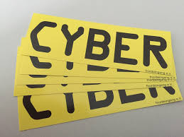

% (IT) Security Know Lunch

--- 

---

> "If privacy is outlawed, only outlaws will have privacy." -- Phil Zimmermann, creator of PGP

> "Arguing that you don't care about privacy because you have nothing to hide
> is no different than saying you don't care about free speech because you have
> nothing to say." -- Edward Snowden

---

---

# Darüber reden wir heute nicht

---

## Physical Security

* wir müssen doch wann anders davon reden

---

## Und trotzdem..

* Lassen Sie Ihr Gepäck nicht unbeaufsichtigt^^
* Bildschirm sperren, wenn man vom Schreibtisch weggeht

---

# Wovon wir heute reden

---

<small>Credits: [https://cyber.equipment/](https://cyber.equipment/)</small>

---

* regelmäßige Updates

---

# Sichere Passwörter

---

* nur du kennst es
* oder nur du hast es

---

<small>Credits: [https://www.xkcd.com/936/](https://www.xkcd.com/936/)</small>

---

Was sagt uns der Comic?

* so viele Zeichen wie möglich nutzen
* kurze Passwörter mit ersetzten Zeichen sind schwierig zu merken und leicht zu knacken

---

## Strategien

1. 4 zufällige häufig vorkommende Wörter
2. Regel: Lieblingslied, -gedicht etc + Teil der Domain Name
3. Password manager: Enpass, KeePass

---

Dennoch

* aufschreiben ist ok 
* (nur nicht auf nem post-it, das am Bildschirm klebt)

---

Und so wie so:

* alle 6 Monate Password ändern

---

## 2-factor Auth

* [https://twofactorauth.org](https://twofactorauth.org)

---

<small>Credits: [http://csharpner.com/blog/index.php/encrypt-all-the-things-a-guide/](http://csharpner.com/blog/index.php/encrypt-all-the-things-a-guide/)</small>

---

## website traffic

* https

---

## Email - mit GPG

* GPG Keys: nur du hast den privaten Schlüssel! Backup!
* Betreff/Metadaten
* Key signing party! 🎉

---

## Festplatten

* regelmäßige Backups (verschlüsselt!)
  * in 2 verschiedenen Orten aufbewahren
  * Wiederherstellung testen^^
* sensible Information vernichten

---

# Außerdem

---

## Smartphones

* noch unsicherer als Rechner^^
* GPG Schlüssel nicht auf den Smartphone laden!
* Messaging

---

## Auf einem Windowsrechner

* Antivirus Software: regelmäßig updaten und laufen lassen
* Firewall

---

## Auf einem öffentlichen Rechner

* am Besten gar nicht benutzen^^
* Privacy Mode im Browser
* immer ausloggen

---

## Im Browser

* adblock
* umatrix
* https everywhere

* Startpage statt Google

---

# 5 Step Action Plan

---

1. Regelmäßig Updates machen
2. Sich eine Passwort-Strategie überlegen und durchziehen
3. Festplatte verschlüsseln
4. Regelmäßige Backups auf eine externe verschlüsselte Festplatte einrichten
5. Verschlüsselte Kommunikation

---

# Fragen?

---

## Lektüreempfehlungen

* [https://xeushack.com/choosing-a-strong-password-in-2017/](https://xeushack.com/choosing-a-strong-password-in-2017/)

* Security in a Box: [https://securityinabox.org/en/](https://securityinabox.org/en/)

---

# Danke!

Dieser Vortrag steht unter der [Creative Commons BY-SA Lizenz](https://creativecommons.org/licenses/by-sa/4.0/deed.de).

