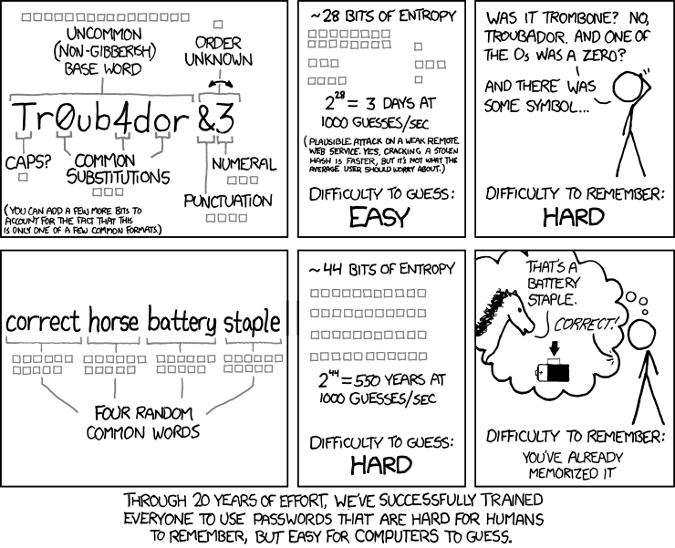

% Email Encryption

---

> "If privacy is outlawed, only outlaws will have privacy." -- Phil Zimmermann, creator of PGP

---

## Why bother?

---

<small>Credits:
[https://github.com/ccchh/Cryptoparty-Slides](https://github.com/ccchh/Cryptoparty-Slides)</small>

---

### Problems with unencrypted email

* not private
* doesn't guarantee the identity of the sender

---

### How does email encryption solve this?

* you can encrypt mail meant for particular receivers so that only they are able to decrypt it and read its contents
* you can digitally sign the mail you send which insures others that the you really were the author of the mail

---

### How does it work?

* mathematical operations with large numbers
* asymmetric encryption: uses a pair of 2 keys
* public key: you distribute it to anyone who will be writing to you
* private key: you use it to decrypt the messages
* keep your private key private
* make a backup

---

### What does email encryption _not_ solve?

* who are you talking to when
* subject line

---

We recommend:

---

---

# Bonus

---

## Physical Security

* don't leave your baggage unattended^^
* lock your screen when you are away

---

## Password managers

* LastPass

---

## Secure passwords

---

<small>Credits: [https://www.xkcd.com/936/](https://www.xkcd.com/936/)</small>

---

* use as many characters as possible
* 4 random common words combined together

---

# Questions?

---

# Hands-on session

---

# Thank you!

This presentation is licensed under the [Creative Commons BY-SA license](https://creativecommons.org/licenses/by-sa/4.0/).

